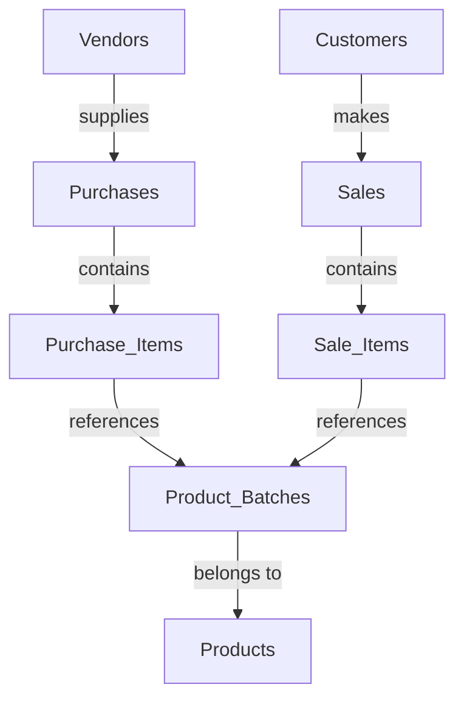

# 📦 StockPilot - Inventory Management System


## 🚀 Overview

**StockPilot** is a comprehensive inventory management system designed for Indian businesses. Built with modern web technologies, it provides complete stock management, purchase tracking, sales monitoring, vendor management, and AI-powered insights.

### ✨ Key Features

- 📊 **Real-time Inventory Tracking** - Monitor stock levels, batches, and product movement
- 🏪 **Vendor Management** - Complete vendor database with performance analytics
- 💰 **Purchase & Sales Management** - Track orders, invoices, and payment status
- 📈 **Advanced Analytics** - Interactive dashboards with forecasting capabilities
- 🤖 **AI Chat Assistant** - Intelligent support for inventory queries
- 📋 **Comprehensive Reports** - Generate detailed PDF reports (Stock Statement, Vendor Performance)
- 🔗 **Third-party Integrations** - Email, Payment Gateway (Razorpay), WhatsApp Business
- 🇮🇳 **India-specific Features** - GST compliance, HSN codes, Indian currency support

## 🏗️ Architecture

### Tech Stack

**Frontend:**
- ⚛️ **React 19** with TypeScript
- 🎨 **Tailwind CSS 4** for styling
- 🧭 **React Router** for navigation
- 📊 **Chart.js** for data visualization
- 🎭 **React Icons** for UI icons
- 🍞 **React Hot Toast** for notifications
- ⚡ **Vite** for build tooling

**Backend:**
- 🚀 **Node.js** with Express.js
- 🍃 **MongoDB** with Mongoose ODM
- 🔐 **JWT Authentication** with bcrypt
- 📧 **Nodemailer** for email services
- 📱 **Twilio** for SMS integration
- 📄 **jsPDF** for report generation
- 🌐 **CORS** enabled for cross-origin requests

## 📁 Project Structure

```
StockPilot/
│
├── 🗂️ backend/                   # Node.js Backend
│   ├── 📁 controllers/           # Business logic controllers
│   │   ├── authController.js     # Authentication logic
│   │   ├── productController.js  # Product management
│   │   ├── purchaseController.js # Purchase operations
│   │   ├── salesController.js    # Sales operations
│   │   └── vendorController.js   # Vendor management
│   │
│   ├── 📁 middleware/            # Custom middleware
│   │   └── auth.js               # JWT authentication middleware
│   │
│   ├── 📁 models/                # MongoDB data models
│   │   ├── User.js               # User authentication
│   │   ├── Products.js           # Product catalog
│   │   ├── Product_batches.js    # Batch tracking
│   │   ├── Vendors.js            # Vendor information
│   │   ├── Purchases.js          # Purchase orders
│   │   ├── Purchase_items.js     # Purchase line items
│   │   ├── Sales.js              # Sales transactions
│   │   ├── Sale_items.js         # Sales line items
│   │   ├── Customers.js          # Customer database
│   │   ├── PurchaseOrder.js      # Purchase order management
│   │   └── Counter.js            # Auto-incrementing IDs
│   │
│   ├── 📁 routes/                # API route definitions
│   │   ├── authRoutes.js         # Authentication endpoints
│   │   ├── productRoutes.js      # Product CRUD operations
│   │   ├── purchaseRoutes.js     # Purchase management
│   │   ├── salesRoutes.js        # Sales operations
│   │   ├── vendorRoutes.js       # Vendor management
│   │   ├── reportRoutes.js       # PDF report generation
│   │   └── forecastRoutes.js     # Analytics & forecasting
│   │
│   ├── 📁 utils/                 # Utility functions
│   │   ├── sequenceGenerator.js  # Auto-increment utilities
│   │   └── twilioIntegration.js  # SMS integration
│   │
│   ├── server.js                 # Express server entry point
│   ├── package.json              # Backend dependencies
│   └── .env                      # Environment variables
│
├── 🗂️ frontend/                  # React Frontend
│   ├── 📁 src/
│   │   ├── 📁 components/        # Reusable UI components
│   │   │   ├── ui/               # shadcn/ui components
│   │   │   ├── AuthRouter.tsx    # Authentication routing
│   │   │   ├── DashboardLayout.tsx # Main layout wrapper
│   │   │   ├── Sidebar.tsx       # Navigation sidebar
│   │   │   ├── Navbar.tsx        # Top navigation
│   │   │   ├── ProtectedRoute.tsx # Route protection
│   │   │   ├── ForecastChart.tsx # Analytics charts
│   │   │   └── RippleGrid.tsx    # UI effects
│   │   │
│   │   ├── 📁 pages/             # Application pages
│   │   │   ├── Landing.tsx       # Landing page
│   │   │   ├── Login.tsx         # Authentication
│   │   │   ├── Dashboard.tsx     # Main dashboard
│   │   │   ├── Inventory.tsx     # Stock management
│   │   │   ├── Sales.tsx         # Sales tracking
│   │   │   ├── Purchases.tsx     # Purchase management
│   │   │   ├── Vendors.tsx       # Vendor management
│   │   │   ├── Reports.tsx       # Report generation
│   │   │   ├── Chat.tsx          # AI assistant
│   │   │   ├── Integrations.tsx  # Third-party integrations
│   │   │   └── [Additional Pages]
│   │   │
│   │   ├── 📁 utils/             # Frontend utilities
│   │   │   └── auth.ts           # Authentication helpers
│   │   │
│   │   ├── 📁 lib/               # Utility libraries
│   │   │   └── utils.ts          # Common utilities
│   │   │
│   │   ├── main.tsx              # React entry point
│   │   ├── App.tsx               # Root component
│   │   └── index.css             # Global styles
│   │
│   ├── 📁 public/                # Static assets
│   ├── package.json              # Frontend dependencies
│   ├── vite.config.ts            # Vite configuration
│   ├── tailwind.config.js        # Tailwind CSS config
│   └── tsconfig.json             # TypeScript config
│
├── Database.txt                  # Database schema documentation
└── README.md                     # Project documentation
```

## 🗃️ Database Schema

### Core Entities

| Entity | Description | Key Fields |
|--------|-------------|------------|
| **Users** | System authentication | email, password, role |
| **Vendors** | Supplier management | vendor_name, phone, email, gst_number |
| **Products** | Product catalog | product_name, category, hsn_code |
| **Product_Batches** | Batch tracking | batch_number, barcode, expiry_date, mrp |
| **Purchases** | Purchase orders | vendor_id, bill_no, total_amount, payment_status |
| **Sales** | Sales transactions | customer_id, sale_date, total_amount, payment_mode |
| **Customers** | Customer database | customer_name, phone, email, gst_number |

### Relationships



## 🚀 Getting Started

### Prerequisites

- **Node.js** (v18 or higher)
- **MongoDB** (v5.0 or higher)
- **npm** or **yarn**

### Installation

1. **Clone the repository**
   ```bash
   git clone https://github.com/TeamEquinox-05/StockPilot.git
   cd StockPilot
   ```

2. **Backend Setup**
   ```bash
   cd backend
   npm install
   ```

3. **Frontend Setup**
   ```bash
   cd ../frontend
   npm install
   ```

4. **Environment Configuration**

   **Backend (.env):**
   ```env
   PORT=5000
   MONGODB_URI=mongodb://localhost:27017/stockpilot
   JWT_SECRET=your_jwt_secret_key
   EMAIL_USER=your_email@gmail.com
   EMAIL_PASS=your_app_password
   TWILIO_ACCOUNT_SID=your_twilio_sid
   TWILIO_AUTH_TOKEN=your_twilio_token
   TWILIO_PHONE_NUMBER=your_twilio_number
   ```

   **Frontend (.env):**
   ```env
   VITE_API_URL=http://localhost:5000
   VITE_APP_NAME=StockPilot
   ```

5. **Start the Application**

   **Backend:**
   ```bash
   cd backend
   npm run dev
   ```

   **Frontend:**
   ```bash
   cd frontend
   npm run dev
   ```

6. **Access the Application**
   - Frontend: `http://localhost:5173`
   - Backend API: `http://localhost:5000`

## 📊 Core Features

### 🏪 Inventory Management
- **Real-time Stock Tracking** - Monitor quantities, batch details, and expiry dates
- **Batch Management** - Track products by batches with barcodes and expiry dates
- **Low Stock Alerts** - Automated notifications for reorder points
- **Product Categorization** - Organize products with HSN codes for GST compliance

### 💼 Vendor Management
- **Vendor Database** - Complete vendor profiles with contact information
- **Performance Analytics** - Track delivery times, quality metrics, and reliability
- **Purchase History** - Complete transaction history with each vendor
- **GST Compliance** - Store GST numbers and generate compliant invoices

### 💰 Purchase & Sales Tracking
- **Purchase Orders** - Create, track, and manage purchase orders
- **Sales Transactions** - Record sales with multiple payment modes (UPI, Card, Cash)
- **Payment Tracking** - Monitor payment status (Paid, Pending, Partial)
- **Invoice Generation** - Automated invoice creation with tax calculations

### 📈 Analytics & Reporting
- **Interactive Dashboard** - Real-time KPIs and performance metrics
- **Sales Forecasting** - AI-powered demand prediction
- **Stock Reports** - Comprehensive PDF reports with current stock status
- **Vendor Performance Reports** - Detailed vendor analysis with delivery metrics

### 🤖 AI Features
- **Chat Assistant** - Intelligent chatbot for inventory queries
- **Demand Forecasting** - Predict future stock requirements
- **Smart Recommendations** - AI-powered reorder suggestions

### 🔗 Integrations
- **Email Service** - Automated notifications and confirmations
- **Razorpay** - Payment gateway integration for online transactions
- **WhatsApp Business** - Customer communication and updates
- **SMS Integration** - Twilio-powered SMS notifications

## 🛠️ API Endpoints

### Authentication
```
POST /api/auth/login          # User login
POST /api/auth/register       # User registration
GET  /api/auth/profile        # Get user profile
```

### Products
```
GET    /api/products          # Get all products
POST   /api/products          # Create new product
PUT    /api/products/:id      # Update product
DELETE /api/products/:id      # Delete product
```

### Vendors
```
GET    /api/vendors           # Get all vendors
POST   /api/vendors           # Create new vendor  
PUT    /api/vendors/:id       # Update vendor
DELETE /api/vendors/:id       # Delete vendor
```

### Purchases
```
GET    /api/purchases         # Get all purchases
POST   /api/purchases         # Create new purchase
GET    /api/purchases/:id     # Get purchase details
PUT    /api/purchases/:id     # Update purchase
```

### Sales
```
GET    /api/sales             # Get all sales
POST   /api/sales             # Create new sale
GET    /api/sales/:id         # Get sale details
PUT    /api/sales/:id         # Update sale
```

### Reports
```
GET    /api/reports/stock-statement      # Generate stock report PDF
GET    /api/reports/vendor-performance   # Generate vendor report PDF
```

## 🎨 UI Components

### Design System
- **Color Palette** - Professional gray and accent colors
- **Typography** - Clean, readable font hierarchy
- **Layout** - Responsive grid system with mobile-first approach
- **Icons** - React Icons library for consistent iconography

### Key Components
- **DashboardLayout** - Main application wrapper with sidebar
- **Sidebar** - Navigation menu with active state indicators
- **Card Components** - Reusable cards for data display
- **Form Components** - Consistent form styling with validation
- **Toast Notifications** - User feedback system

## 🚀 Deployment

### Production Build

**Frontend:**
```bash
cd frontend
npm run build
```

**Backend:**
```bash
cd backend
npm start
```

### Environment Variables (Production)
```env
NODE_ENV=production
MONGODB_URI=mongodb://your-production-db
JWT_SECRET=your-secure-jwt-secret
```

## 🤝 Contributing

1. Fork the repository
2. Create your feature branch (`git checkout -b feature/AmazingFeature`)
3. Commit your changes (`git commit -m 'Add some AmazingFeature'`)
4. Push to the branch (`git push origin feature/AmazingFeature`)
5. Open a Pull Request

## 📄 License

This project is licensed under the ISC License - see the [LICENSE](LICENSE) file for details.

## 👥 Team

**Team Equinox-05**
- Project maintained by passionate developers
- Built for HackForge hackathon
- Focused on solving real-world inventory management challenges

## 🆘 Support

For support, email support@stockpilot.com or join our community discord.

## 🙏 Acknowledgments

- Built with modern web technologies
- Inspired by real inventory management challenges
- Thanks to all contributors and testers

---

**StockPilot** - *Navigating Your Inventory to Success* 🚀


 - Inventory Management System

A modern inventory management system built with React, Node.js, and MongoDB.

## Setup Instructions

### Backend Setup

1. Navigate to the backend directory:
   ```bash
   cd backend
   ```

2. Install dependencies:
   ```bash
   npm install
   ```

3. Create environment file:
   ```bash
   cp .env.example .env
   ```

4. Update the `.env` file with your values:
   ```env
   JWT_SECRET=your_super_secret_jwt_key_here_make_it_long_and_complex
   MONGODB_URI=mongodb://localhost:27017/stockpilot
   PORT=5000
   NODE_ENV=development
   ```

5. Start the server:
   ```bash
   npm run dev
   ```

### Frontend Setup

1. Navigate to the frontend directory:
   ```bash
   cd frontend
   ```

2. Install dependencies:
   ```bash
   npm install
   ```

3. Create environment file:
   ```bash
   cp .env.example .env
   ```

4. Update the `.env` file with your values:
   ```env
   VITE_API_BASE_URL=http://localhost:5000
   VITE_API_AUTH_ENDPOINT=/api/auth
   VITE_APP_NAME=StockPilot
   VITE_ENV=development
   ```

5. Start the development server:
   ```bash
   npm run dev
   ```

### MongoDB Setup

Make sure you have MongoDB running locally on port 27017, or update the `MONGODB_URI` in your backend `.env` file to point to your MongoDB instance.

## Environment Variables

### Backend (.env)
- `JWT_SECRET`: Secret key for JWT token signing (make it long and complex)
- `MONGODB_URI`: MongoDB connection string
- `PORT`: Port number for the backend server
- `NODE_ENV`: Environment mode (development/production)

### Frontend (.env)
- `VITE_API_BASE_URL`: Base URL for the backend API
- `VITE_API_AUTH_ENDPOINT`: Authentication endpoint path
- `VITE_APP_NAME`: Application name displayed in the UI
- `VITE_ENV`: Environment mode

## Features

### 🔐 Authentication & Security
- ✅ User authentication with JWT tokens
- ✅ Protected routes and automatic login redirects
- ✅ Secure token management with automatic refresh
- ✅ Password hashing with bcrypt
- ✅ Role-based access control

### 🏪 Vendor Management
- ✅ Add new vendors with complete contact information
- ✅ View all vendors in organized table format
- ✅ Vendor selection in purchase workflows
- ✅ Vendor contact details (name, phone, email, address)

### 📦 Product Management
- ✅ Add new products with categories
- ✅ Product search and autocomplete functionality
- ✅ Product batch management system
- ✅ Barcode support (optional field)
- ✅ Expiry date tracking
- ✅ MRP and tax rate management

### 🛒 Purchase Management
- ✅ Create purchase orders with multiple items
- ✅ Intelligent product autocomplete with batch details
- ✅ Dynamic vendor selection
- ✅ Real-time quantity and pricing calculations
- ✅ Batch number generation and tracking
- ✅ Expiry date management with validation
- ✅ Tax rate configuration per product
- ✅ Purchase history and tracking

### 💰 Sales Management
- ✅ Point-of-Sale (POS) interface
- ✅ Product search with live autocomplete suggestions
- ✅ Stock availability checking in real-time
- ✅ Customer information management
- ✅ Auto-incrementing bill number system (BILL-YYYYMMDD-XXXX format)
- ✅ Professional sales table with item details
- ✅ Percentage-based discount system
- ✅ Tax calculations using actual purchase tax rates
- ✅ Payment method selection (Cash, Card, UPI)
- ✅ Sale validation and confirmation dialogs
- ✅ Receipt generation with professional formatting
- ✅ Automatic stock deduction after sales

### 📊 Inventory Tracking
- ✅ Real-time stock level monitoring
- ✅ Automatic stock updates on purchases and sales
- ✅ Batch-wise inventory tracking
- ✅ Stock availability checks during sales
- ✅ Quantity validation and alerts

### 🎨 User Interface & Experience
- ✅ Clean, professional UI design with Tailwind CSS
- ✅ Responsive sidebar navigation
- ✅ Modern component library (ShadCN UI)
- ✅ Professional table layouts matching business standards
- ✅ Loading states and user feedback
- ✅ Error handling with user-friendly messages
- ✅ Confirmation dialogs for critical actions

### 🔧 Technical Features
- ✅ Environment-based configuration
- ✅ Hot reloading during development
- ✅ TypeScript for type safety
- ✅ RESTful API architecture
- ✅ MongoDB database with optimized schemas
- ✅ CORS enabled for cross-origin requests
- ✅ Input validation on both frontend and backend
- ✅ Error logging and debugging endpoints

## API Endpoints

### Authentication Routes (`/api/auth`)
- `POST /register` - User registration
- `POST /login` - User login with JWT token generation
- `GET /verify` - Token verification and user details

### Vendor Routes (`/api/vendors`)
- `GET /` - Get all vendors
- `POST /` - Create new vendor
- `GET /:id` - Get vendor by ID
- `PUT /:id` - Update vendor
- `DELETE /:id` - Delete vendor

### Product Routes (`/api/products`)
- `GET /` - Get all products
- `POST /` - Create new product
- `GET /search` - Search products with autocomplete
- `GET /:id` - Get product by ID
- `PUT /:id` - Update product
- `DELETE /:id` - Delete product

### Purchase Routes (`/api/purchases`)
- `GET /` - Get all purchases
- `POST /` - Create new purchase with items
- `GET /search-products` - Search products for purchase autocomplete
- `GET /:id` - Get purchase by ID with items
- `PUT /:id` - Update purchase
- `DELETE /:id` - Delete purchase

### Sales Routes (`/api/sales`)
- `GET /` - Get all sales
- `POST /` - Create new sale with automatic stock deduction
- `GET /search-products` - Search products for sales with stock availability
- `GET /next-bill-number` - Generate next auto-incrementing bill number
- `GET /debug/products` - Debug endpoint for product verification
- `GET /:id` - Get sale by ID with items

### Health Check
- `GET /api/health` - Server health status

## Database Schema

### Collections
- **users** - User authentication and profile data
- **vendors** - Vendor contact and business information  
- **products** - Product catalog with categories
- **product_batches** - Batch-wise inventory with stock levels
- **purchases** - Purchase orders and vendor transactions
- **purchase_items** - Individual items within purchase orders
- **sales** - Sales transactions and customer information
- **sale_items** - Individual items within sales transactions

## Tech Stack

**Frontend:**
- React 18 with TypeScript
- Vite for build tooling and hot reloading
- Tailwind CSS for responsive styling
- ShadCN UI components for modern interface
- React Router for client-side navigation
- Fetch API for HTTP requests

**Backend:**
- Node.js with Express framework
- MongoDB with Mongoose ODM
- JWT for secure authentication
- bcrypt for password hashing
- CORS enabled for cross-origin requests
- dotenv for environment configuration

**Development Tools:**
- TypeScript for type safety
- ESLint for code quality
- Environment-based configuration
- Hot reloading for both frontend and backend

## Project Structure

```
StockPilot/
├── backend/
│   ├── controllers/          # API route handlers
│   │   ├── authController.js
│   │   ├── salesController.js
│   │   ├── purchaseController.js
│   │   ├── productController.js
│   │   └── vendorController.js
│   ├── models/              # MongoDB schemas
│   │   ├── User.js
│   │   ├── Vendor.js
│   │   ├── Product.js
│   │   ├── ProductBatch.js
│   │   ├── Purchase.js
│   │   ├── PurchaseItem.js
│   │   ├── Sale.js
│   │   └── SaleItem.js
│   ├── routes/              # API route definitions
│   │   ├── authRoutes.js
│   │   ├── salesRoutes.js
│   │   ├── purchaseRoutes.js
│   │   ├── productRoutes.js
│   │   └── vendorRoutes.js
│   ├── middleware/          # Custom middleware
│   │   └── auth.js
│   ├── .env.example         # Environment variables template
│   ├── package.json
│   └── server.js           # Application entry point
├── frontend/
│   ├── src/
│   │   ├── components/      # Reusable UI components
│   │   │   ├── ui/         # ShadCN UI components
│   │   │   ├── AuthRouter.tsx
│   │   │   ├── DashboardLayout.tsx
│   │   │   ├── Navbar.tsx
│   │   │   ├── ProtectedRoute.tsx
│   │   │   └── Sidebar.tsx
│   │   ├── pages/          # Application pages
│   │   │   ├── Dashboard.tsx
│   │   │   ├── Home.tsx
│   │   │   ├── Inventory.tsx
│   │   │   ├── Landing.tsx
│   │   │   ├── Login.tsx
│   │   │   ├── Purchases.tsx
│   │   │   └── Sales.tsx
│   │   ├── utils/          # Utility functions
│   │   │   └── auth.ts
│   │   ├── lib/           # Library configurations
│   │   │   └── utils.ts
│   │   ├── App.tsx        # Main application component
│   │   └── main.tsx       # Application entry point
│   ├── .env.example       # Environment variables template
│   ├── package.json
│   ├── tailwind.config.js
│   ├── tsconfig.json
│   └── vite.config.ts
└── README.md
```

## Usage Examples

### Creating a Purchase Order
1. Navigate to Purchases page
2. Select vendor from dropdown
3. Search and add products using autocomplete
4. Set quantities, MRP, and tax rates
5. Batch numbers auto-generate or can be manually entered
6. Add expiry dates where applicable
7. Submit purchase to update inventory

### Processing a Sale
1. Navigate to Sales page  
2. Search products using autocomplete (shows only items in stock)
3. Add items to cart with quantities
4. Apply percentage-based discounts if needed
5. Enter customer details
6. System auto-generates bill number (BILL-YYYYMMDD-XXXX format)
7. Complete sale to automatically:
   - Deduct stock quantities
   - Generate professional receipt
   - Store transaction records

### Managing Inventory
- Real-time stock levels displayed during product search
- Batch-wise tracking with expiry date monitoring
- Automatic stock updates on purchases and sales
- Stock availability validation prevents overselling

## Development

Both frontend and backend support hot reloading during development. Make sure to have both servers running for full functionality.

**Frontend:** http://localhost:5173  
**Backend:** http://localhost:5000

### Development Commands
```bash
# Backend
cd backend
npm run dev        # Start with nodemon
npm start         # Start production server

# Frontend  
cd frontend
npm run dev       # Start development server
npm run build     # Build for production
npm run preview   # Preview production build
```